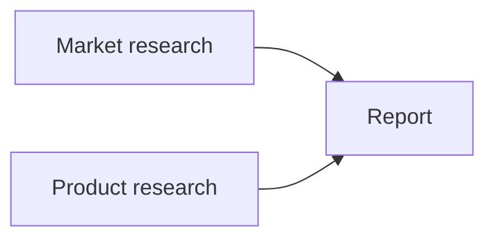

# Durable execution

`@anvia/durable` adds a persisted execution lifecycle to existing Anvia agents. Direct
`agent.generate()` and `agent.stream()` remain available. Durable execution uses
`runtime.submit()` and a `DurableRun` handle instead.

For versioned custom tasks, dynamic owned agents, child joins, timers, and external signals,
see [Durable tasks and owned agent work](./durable-tasks.md).

## Execution model

An agent definition is registered with an explicit version. Submitting a string prompt
atomically stores a queued request and a submission event before starting work. Session
history is captured when that request reaches the head of its session queue. Repeated submission IDs return the original run; conflicting inputs fail.

The runtime uses core's model and tool execution boundaries. Agent registrations use
`generate()` by default; `stream: true` selects `agent.stream()` with the same checkpoint guarantees. Before a model request or an
approved tool call, it commits an operation intent. After the operation returns, it commits
the normalized result and event together. Tool checkpoint errors propagate out of the agent
loop; they are not converted into ordinary tool errors for the model to ignore.

On recovery, the agent reconstructs its loop using recorded model and tool results. This is
operation-result replay, not JavaScript stack restoration. Registered code must remain
compatible: use deterministic, side-effect-free tool definitions, input/output parsers,
schemas, and approval predicates. Change the registration version when their behavior, model,
instructions, or tools change. Restore the original version to resume blocked old work;
automatic checkpoint migrations are not implemented.

Recovery checks saved operation inputs against newly constructed inputs. Stored recovery
policies cannot be relaxed by changing the current registration. Unknown agent versions
become `needs_attention` without executing tools or calling models.

## Storage and ownership

Import `SqliteDurableStore` from `@anvia/durable/sqlite`; the package root does not import
Node's SQLite module. Use a dedicated database on a local filesystem. The adapter uses WAL,
full synchronous commits, and atomic transactions for run state, operation results, and events.

One runtime owns a database. A second live owner is rejected. After a crash on the same host,
ownership can be recovered once the old PID no longer exists. PID reuse conservatively blocks
recovery. Cross-host filesystems, shared PID namespaces with ambiguous host identity, worker
leases, and distributed execution are unsupported. Memory-only SQLite (`:memory:`) is useful
for tests but does not survive restart.

`DurableStore` is a synchronous transactional contract. A custom implementation must provide
exclusive ownership, atomic writes, detached read values, validation, ordered event cursors,
and the same deduplication and history semantics. Transaction callbacks must not perform
external work, return promises, or retain their transaction handle.

The database contains prompts, normalized responses, tool arguments/results, and interaction
state. Keep it in application-private storage. Provider SDK raw responses are not persisted.
Retention, encryption, authentication, and authorization belong to the hosting application.

## Tool recovery

| Policy             | Interrupted operation                                                                                               |
| ------------------ | ------------------------------------------------------------------------------------------------------------------- |
| `manual` (default) | Pause for external reconciliation; do not repeat automatically.                                                     |
| `safe`             | Repeat the operation; use for calls whose repetition is acceptable.                                                 |
| `idempotent`       | Repeat with the same `ToolCallContext.operationId`; the tool must pass it to a service that enforces deduplication. |

The stable external key combines the run ID and checkpoint key. The event's `operationId`
and snapshot's `blockedOperation` are run-local checkpoint keys, used for inspection and
reconciliation. Completed tool results are reused under all three policies. Ordinary tool
errors become recorded error results according to core's normal behavior.

The critical ambiguous interval is: external action succeeds, then the process dies before
its result commits. Durable storage alone cannot guarantee exactly-once external effects.
After inspecting the actual outcome, reconcile it explicitly:

```ts
const run = await runtime.getRun(runId);
const snapshot = await run.snapshot();
if (snapshot.run.status === "needs_attention" && snapshot.run.blockedOperation) {
  // Verify the ticket exists in the external system before supplying its result.
  await run.resolveTool(snapshot.run.blockedOperation, {
    type: "json",
    value: { ticketId: "verified-ticket-id" },
  });
}
```

`run.retry()` reattempts a failed or blocked run, subject to the same recovery checks. It
does not override manual recovery. Retry is rejected if a later submission has started and advanced the
session. Cancelling a successor before it starts does not advance the session. Explicit
retry resets the attempt counters of unfinished model operations; completed results remain
intact. Model requests use one core attempt per execution. Model-turn limits and committed usage span approval resumptions and restarts.

## Run discovery and inspection

```ts
const page = await runtime.listRuns({
  sessionId: "research-session", // omit for trusted local administration across sessions
  status: "waiting", // optional: find approvals, failures, or recovery blocks
  limit: 25,
});
for (const summary of page.runs) {
  const run = await runtime.getRun(summary.id);
  const snapshot = await run.snapshot();
  // Inspect snapshot.run.outcome for approvals, or blockedOperation for reconciliation.
}
// Continue with the same filters and after: page.nextCursor when present.
```

Listings return summaries without prompts, histories, or operation results. Filters support
`sessionId`, `agentId`, and `status`. Pages contain at most 100 runs, in insertion order;
`nextCursor` is an exclusive insertion cursor, separate from progress-event cursors. Status
filters reflect live state: restart a listing to discover older runs whose status changed.
For 250 ms status polling, use `runtime.status(id)` (or `await run.status()`), which reads a
bounded `DurableRunSummary` without decoding histories or operation records. `runtime.run(id)`
returns the full `DurableRunRecord` without operations. Use
`runtime.snapshot(id, { operations: false })` for the run record and atomic event cursor;
its `operations` array is empty. Listings use stored summaries, and `runScope`, task graphs,
and default task snapshots do not decode operation payloads.

Starting in durable 0.7, SQLite operation snapshots use shared message-log references.
For a model operation with `historyEncoding: "linked-v1"`, `input.request.chatHistory`
is an opaque `{ head, length }` reference. Reconstruct the original request with
`runtime.operationRequest(id, operation.key)`; this also reads legacy embedded requests.
Context operation inputs and prepared messages are likewise compact. Task snapshots default
to no operations; request `task.snapshot({ operations: true })` to inspect effects.
This is a breaking snapshot shape change. Event payloads and cursors remain unchanged.
See the [package migration details](../../packages/durable/README.md#queues-inspection-and-http)
for custom stores and the schema upgrade.

Use `getRun(id).snapshot()` for full execution details and existing handle methods for retry,
cancellation, interaction responses, and reconciliation.

## Scheduling and model backoff

```ts
const runtime = await DurableRuntime.open({
  store: new SqliteDurableStore("./anvia-runs.sqlite"),
  maxConcurrentRuns: 4,
  agents: [
    {
      agent: researcher,
      version: "1",
      modelRetry: { maxAttempts: 3, initialDelayMs: 1000, maxDelayMs: 30_000 },
    },
  ],
});
await runtime.resume();
await runtime.submit(
  {
    agentId: researcher.id,
    sessionId: "research-session",
    requestId: "follow-up",
    prompt: "Expand the previous findings.",
  },
  { enqueue: true },
);
```

`maxConcurrentRuns` defaults to 4 (range 1–1000). Only the oldest unfinished run in each
session is eligible. `enqueue: true` accepts a persisted successor; otherwise submitting into
an unfinished session still fails. Repeated request IDs return the original run regardless
of the enqueue option. Queued work survives shutdown and restart.

A queued run receives the latest completed session history when execution starts. Failed
or cancelled predecessors release the queue without adding their partial work to history.
Approvals and `needs_attention` block their session queue while releasing global execution
capacity. Cancelling an active run keeps its slot occupied until its callbacks settle.

`modelRetry` is opt-in and copied into the submission. It retries **errors thrown within the core completion attempt**, including permanent provider
errors and capability/response/structured-output validation errors, up to a bounded attempt
budget. It does not retry observer, local post-processing, checkpoint, quota, model-turn-budget,
or tool failures. There is no transient-error classifier in this version. Each model operation
has its own attempt count, persisted before entering core completion; crashes consume an
attempt. A counted attempt may fail validation before contacting the provider.
The initial request counts toward `maxAttempts`. Recovery refuses an exhausted operation
until a caller explicitly invokes `run.retry()`, which resets unfinished model counters.

Backoff doubles from `initialDelayMs`, capped at `maxDelayMs`, without jitter. The runtime
persists `retry_wait` and `nextAttemptAt` atomically with the failure. Waiting releases the
execution slot but preserves session order. Restarting before the deadline waits out the
remaining delay; changing the registration does not change the saved policy. Cancellation
removes the deadline. Scheduling timers do not keep a Node process alive on their own; a
server/worker host must remain running. This is a single-owner scheduler, not a distributed
worker service.

## Task dependencies and exposed graphs

`runtime.submitGraph()` persists a static DAG of registered-agent tasks. Graph definition,
child run IDs, node submissions, and their events commit in one transaction. The graph has
its own `(sessionId, requestId)` deduplication scope, separate from ordinary submissions.
An identical definition returns the existing graph; changing it under the same key fails.
Duplicate IDs, unknown agents/dependencies, and cycles are rejected before work starts.
The first version allows 1–100 tasks, with stable alphanumeric/dash/underscore task IDs.

```ts
const graph = await runtime.submitGraph({
  sessionId: "research-project",
  requestId: "report-42",
  tasks: [
    { id: "market", agentId: "researcher", prompt: "Research the market." },
    { id: "product", agentId: "researcher", prompt: "Research the product." },
    {
      id: "report",
      agentId: "writer",
      prompt: "Synthesize the dependency results.",
      dependsOn: ["market", "product"],
    },
  ],
});
```



The two roots can run concurrently within `maxConcurrentRuns`. The report becomes eligible
only after **both** prerequisites commit a `response` outcome. A failed/cancelled prerequisite
or a completed non-response outcome does not release its dependents. Independent branches
continue. Failed dependencies leave the graph blocked until the caller retries the failed
node or cancels the graph; there is no implicit skip or continue-on-error policy.

Each task is an ordinary durable agent run with a generated, reserved session. This isolates
branch histories and permits parallel work. Graph tasks do not append to the owning session's
conversation history. On first activation, the node receives its prompt followed by
`Task dependency results (JSON):` and a JSON object keyed by prerequisite task ID containing
each full response output. That resolved input is persisted before execution and reused on
recovery. Arbitrary JavaScript input-mapping callbacks are not replayed.

Inspect and observe the exposed graph:

```ts
const snapshot = await graph.snapshot();
// snapshot.nodes: { id, agentId, runId, status, wait?, output?, interaction?, error? }
// snapshot.edges: { source, target }[]
// snapshot.status: running | waiting | blocked | completed | cancelled
renderGraph(snapshot);
for await (const event of graph.stream({ after: snapshot.cursor })) {
  // Each committed event carries graphId, taskId, runId, and its global sequence.
  // Refresh the atomic snapshot to update nodes, dependency readiness, and aggregate status.
  renderGraph(await graph.snapshot());
}
```

A node's `status` is its underlying durable run status. Its `wait` explains why it cannot
currently run:

| Wait type           | Meaning                                                                         | What resumes it                                          |
| ------------------- | ------------------------------------------------------------------------------- | -------------------------------------------------------- |
| `dependencies`      | Direct prerequisites have not succeeded                                         | Their successful completion, automatically               |
| `dependency_failed` | A direct prerequisite failed, was cancelled, or produced a non-response outcome | Successful retry where supported, or a new graph         |
| `capacity`          | Ready but waiting for an execution slot                                         | Capacity becoming available, automatically               |
| `interaction`       | Approval or question pending                                                    | An explicit `run.respond()`                              |
| `retry`             | Persisted completion retry deadline                                             | Deadline, automatically while the host is alive          |
| `recovery`          | Version mismatch or uncertain tool effect                                       | Restore compatible code and retry, or reconcile the tool |

Graph status is `running` while some task is running or ready; otherwise it is `blocked`
when a task has failed/cancelled or needs recovery, and `waiting` for interactions or retry
deadlines. `completed` requires every task to have a successful response. A graph stream
stays open during blocked/waiting states and ends on graph completion or explicit graph
cancellation. Its event payloads describe individual run transitions; use a fresh snapshot
for the current graph-wide view.

Use `snapshot.nodes[i].runId` with `runtime.getRun()` and existing `respond`, `retry`,
`resolveTool`, or `cancel` methods. Resolving a prerequisite automatically makes its children
eligible. `graph.cancel()` atomically cancels unfinished tasks and records graph cancellation,
then aborts active callbacks; it cannot undo completed external effects. Cancelled graphs
cannot be restarted by retrying their nodes. A completed graph remains completed.

After process restart, call `runtime.resume()` once. It discovers eligible graph nodes from
the saved dependencies and run states. Completed prerequisite outputs are reused. A pending
approval remains pending; a retry deadline remains scheduled; exhausted retry budgets and
uncertain effects still require explicit intervention. The runtime does not restart its host
process. Deployments must arrange process startup themselves.

`runtime.getGraph(id)` returns a handle. `runtime.listGraphs({ sessionId, after, limit })`
returns insertion-ordered identity summaries, capped at 100 per page. These graph cursors
are separate from event cursors. Ordinary `listRuns({sessionId})` lists that conversation's
runs; graph child runs use their isolated sessions and are discovered through the graph.

The same functionality is available through `DurableClient.submitGraph`, `graphSnapshot`,
`listGraphs`, `streamGraph`, and `cancelGraph`, and the following HTTP routes:

| Method | Path                                   | Result                                                  |
| ------ | -------------------------------------- | ------------------------------------------------------- |
| POST   | `/durable/graphs`                      | Submit the graph definition and return a snapshot (202) |
| GET    | `/durable/graphs?sessionId=...`        | List graph identities with optional `after`, `limit`    |
| GET    | `/durable/graphs/:id`                  | Atomic topology, live node state, and event cursor      |
| GET    | `/durable/graphs/:id/events?after=...` | SSE task events; `Last-Event-ID` fallback               |
| POST   | `/durable/graphs/:id/cancel`           | Cancel unfinished graph work (204)                      |

Graph-wide submission, inspection, streaming, and cancellation authorize **every task**.
The authorization context includes its agent and task IDs, plus graph/run IDs when available.
Existing `/runs/:id` routes authorize graph children against the graph's owning `sessionId`,
not their generated execution session. Graph listing requires owning-session access.

SQLite schema version 2 added graph records and dependency-aware scheduling. The current
schema version 7 includes persisted context projections and typed turn exhaustion. Version 1–6 stores upgrade
on ownership acquisition, preserving existing runs. Older engines reject the upgraded database.
Downgrading the database is unsupported.

`submitGraph()` remains a static agent-task DAG. For dynamic children, custom work, timers,
and external signals, use the [custom task API](./durable-tasks.md). Editing submitted DAGs,
conditional DAG edges, durable core Pipeline execution, and a Studio graph UI remain future work.

## Observing and reconnecting

`run.stream()` yields persisted `submitted`, `status`, `model_started`, `model_completed`,
`tool_started`, and `tool_completed` events. Model completion events include the normalized
response. With `stream: true` on the agent registration, the iterator also yields
`model_attempt_started`, `model_delta`, and `model_attempt_failed`. These carry an
`operationId` and unique `attemptId`; each delta wraps a normalized core generation `event`.
The validated response in `model_completed` carries that attempt ID and remains the checkpoint.
Streaming completion observers run after that response is committed, so their failure does
not discard the model result or automatically invoke the provider again. An attempt failure's
`failureKind` distinguishes `model` execution/validation from `local` failures.

See [streaming model output](../../packages/durable/README.md#streaming-model-output) for
configuration and recovery semantics. Replace partial output when a new attempt starts for
an operation, and discard it on attempt failure or cancellation. A restarted model request
starts a new stream; it does not continue previous partial tokens. Committed model/tool results
are reused without appending duplicate delta events. The streaming option is captured at
submission for root runs, graph nodes, and owned agents.

Snapshots atomically include the run, its saved operations (including intermediate model
and tool results), and an event cursor. For reconnection, restore the snapshot and then
subscribe after its cursor. Snapshots omit partial token text: for a streaming UI, replay
from zero or resume after the last event cursor already rendered instead:

```ts
const run = await runtime.getRun(runId);
const snapshot = await run.snapshot();
render(snapshot);
for await (const event of run.stream({ after: snapshot.cursor, abortSignal })) {
  renderEvent(event);
}
```

The iterator reads bounded pages and polls while idle. Closing it or aborting its subscription
does not cancel the run. Streams finish on completed, failed, or cancelled runs. They remain
open during approvals and recovery blocks. `run.result({ abortSignal })` waits for a terminal
outcome, throwing `DurableRunError` for failure/cancellation. An application must separately
observe and resolve pending interactions; waiting for the result does not approve them.

## Approvals and questions

Existing `requiresApproval` tools and question tools use core's interaction protocol. A
waiting snapshot contains the `AgentInteractionOutcome`, including the continuation:

```ts
const { run: snapshot } = await run.snapshot();
if (snapshot.status === "waiting" && snapshot.outcome?.type === "interaction") {
  const interaction = snapshot.outcome.interaction;
  if (interaction.type === "tool-approval") {
    // Obtain and authorize the person's decision in your application first.
    await run.respond(interaction.id, { type: "tool-approval", approved });
  }
}
```

Responses are validated and persisted atomically with the continuation transition. Repeating
the same response is harmless; a conflicting response fails. Reopening the runtime does not
discard a pending interaction or execute its tool before approval.

## Steering an active run

```ts
const receipt = await run.steer(
  { prompt: "Focus on the recovery behavior." },
  { requestId: "correction-123" }, // optional; reuse when retrying delivery
);
// receipt: { id: "correction-123", status: "queued" }
```

`runtime.steer(runId, input, options)` provides the same control. Input accepts exactly
one of `prompt` (text or a structured user message) and `messages` (a nonempty array of
user messages). The receipt confirms persistence, not model consumption. Reusing a request
ID with equivalent messages returns the original receipt; different input conflicts.

Steering is applied in acceptance order at the next safe boundary: before the first model
call, after the current tool batch, or after a model answer before finalization. It never
interrupts an in-flight model/tool call. `steering_queued` and `steering_applied` are committed
progress events; the latter includes the receipt `id`, `epoch`, and boundary `turn` (`0`
before the initial model call). Snapshots retain pending input and applied checkpoints.
Empty boundaries are saved too, so restart/retry cannot change an already saved model request.
Applied messages remain in the canonical conversation and subsequent session history.

Waiting approvals and recovery blocks accept steering but still require `respond()` or
reconciliation before execution continues. Steering consumes the existing model-turn budget;
it does not extend it or guarantee another model call if the run fails or is cancelled.
New input is rejected once finalization begins or the run is terminal. Duplicate request IDs
can still acknowledge earlier acceptance. Owned runs also obey their parent task's controls.

Steering is available on runs submitted by this release, including graph and owned-agent
runs. Legacy runs keep their old replay boundaries and reject steering. Custom task handlers
continue to use `signal()`. Steering state counts toward `limits.maxPayloadBytes`.

## HTTP server and client

Import `createDurableHandler` from `@anvia/server/durable` and `DurableClient` from
`@anvia/client/durable`. These opt-in subpaths require `@anvia/durable`; the existing server
and client entrypoints do not load the durable runtime or SQLite. The browser client uses
the validated `@anvia/durable/protocol` entrypoint.

```ts
import { createDurableHandler } from "@anvia/server/durable";

const handleRequest = createDurableHandler({
  runtime,
  basePath: "/durable",
  authorize: async (request, resource) => {
    const user = await authenticate(request); // supplied by your application
    return user !== null && (await canAccessSession(user, resource.sessionId, resource.action));
  },
});
// Mount handleRequest in your Fetch-compatible server; retain runtime at application scope.
```

Authorization is required for every operation, including event subscriptions and inspection.
The callback receives `action`, `sessionId`, and, for existing runs, `runId` and `agentId`;
submission authorization also receives `agentId`. Enforce agent access as needed. Existing
run authorization uses the session stored in the database, not a client-supplied session.
HTTP listings require `sessionId`. Your host supplies identity, CORS/CSRF policy where
applicable, and startup/shutdown lifecycle. An authorized SSE subscription lasts until it
ends or disconnects; authorization is checked at connection time.

| Method | Path                                 | Result                                                                            |
| ------ | ------------------------------------ | --------------------------------------------------------------------------------- |
| POST   | `/durable/runs`                      | Submit `{agentId, sessionId, requestId, prompt, enqueue?}`; return snapshot (202) |
| GET    | `/durable/runs?sessionId=...`        | List summaries; optional `agentId`, `status`, `after`, `limit`                    |
| GET    | `/durable/runs/:id`                  | Atomic snapshot                                                                   |
| GET    | `/durable/runs/:id/events?after=...` | SSE committed events; `Last-Event-ID` is the fallback cursor                      |
| POST   | `/durable/runs/:id/steer`            | `{input: {prompt} or {messages}, requestId?}`; returns a receipt (202)            |
| POST   | `/durable/runs/:id/respond`          | `{interactionId, response}`                                                       |
| POST   | `/durable/runs/:id/resolve-tool`     | `{operationId, output}`                                                           |
| POST   | `/durable/runs/:id/retry`            | Explicitly retry                                                                  |
| POST   | `/durable/runs/:id/cancel`           | Persist cancellation                                                              |

Mutation endpoints other than submit and steer return 204. JSON bodies default to a 64 KiB limit,
configurable through `maxBodyBytes`. Validation errors return 400, denial 403, missing runs
404, conflicts 409, oversized bodies 413, unsupported media types 415, and unexpected errors
500 without internal diagnostics. Responses disable caching. SSE frames include the durable
event sequence as `id`; transport errors close the stream without cancelling execution.

```ts
import { DurableClient } from "@anvia/client/durable";

const client = new DurableClient({
  endpoint: "https://your-app.example/durable",
  headers: () => ({ Authorization: `Bearer ${getAccessToken()}` }),
});
const accepted = await client.submit(
  {
    agentId: "researcher",
    sessionId: "research-session",
    requestId: "research-job-42",
    prompt: "Summarize these notes...",
  },
  { enqueue: true },
);
const snapshot = await client.snapshot(accepted.run.id);
render(snapshot);
for await (const event of client.stream(accepted.run.id, { after: snapshot.cursor })) {
  renderEvent(event);
}
```

Use `client.steer(runId, { prompt: "Focus on recovery" }, { requestId: "correction-123" })`
for the same persisted control over HTTP. The handler authorizes it with action `steer`.

The client also exposes `listRuns`, `respond`, `resolveTool`, `retry`, and `cancel`. Request
options accept `abortSignal`; streaming cancellation only detaches that subscriber. The
client validates incoming snapshots and events and rejects wrong-run or out-of-order events.
On a connection failure, reconnect explicitly from a new snapshot, or from the last event
cursor your application successfully applied. It does not retry HTTP mutations automatically.
Durable progress is not the existing token-delta chat protocol.

## Shutdown and current scope

- `runtime.resume()` schedules pending and interrupted runs without waiting for completion.
- `runtime.close()` aborts attempts, waits for callbacks to settle, and releases storage.
  Interrupted work retains its checkpoints. Tools and models must honor abort signals for
  prompt shutdown; closing cannot force-stop arbitrary JavaScript callbacks.
- `run.cancel()` persists explicit cancellation. It cannot undo an external effect. A new
  run in the same session is rejected while the cancelled callback is still settling.
- Each session executes one run at a time; opt-in persisted successors wait in FIFO order.
  The runtime bounds cross-session concurrency. Mid-run steering is not supported.
- Supported: static local tools, approvals/questions, JSON-serializable structured output,
  provider-neutral completion models, and persisted session history.
- Agent memory, lifecycle callbacks, middleware, guardrails, context sources, MCP, provider
  tools, and dynamic tool indexes are rejected at registration because they need additional
  persistence boundaries. Durable session history replaces the agent's memory store here.
- Observability callbacks may run again during reconstruction; they must be safe to repeat.
  They are not the authoritative execution journal.
- Pipeline/team recovery, Studio integration,
  Postgres, retention, general migration tooling, and distributed worker deployment are follow-up work.
  Database records are experimental; the task-aware engine upgrades schema 1–8 to 9 on acquisition. Older engines reject schema 9. Core execution protocol 4 is required.

## Operational readiness

See the [operations guide](./durable-operations.md) for fail-closed storage handling, readiness,
metrics, admission limits, offline backup/restore, upgrade/rollback, and staged rollout.
The SQLite package now requires Node.js 22.16 or newer. Custom task HTTP controls are covered
in the [task guide](./durable-tasks.md#remote-task-controls).

## Verification

Run from the repository root:

```sh
pnpm --filter @anvia/core build
pnpm --filter @anvia/durable typecheck
pnpm --filter @anvia/durable test
pnpm --filter @anvia/durable build
pnpm --filter @anvia/client build
pnpm --filter @anvia/server build
pnpm --filter @anvia/client test
pnpm --filter @anvia/server test
```

Tests use fake models and local SQLite. Recovery tests kill child processes at real model/tool
boundaries, then reopen the same database to verify completed-result reuse and conservative
handling of uncertain effects. No provider credentials or Docker are required.

## Conversation compaction

Durable registrations accept an opt-in `compaction` policy with `trigger.afterTokens`,
`retention.recentTurns` / `retention.recentToolTurns`, a core-compatible `compactor`, and optional `tokenCounter`.
It summarizes completed history before a new session run and completed exchanges inside tool loops,
then persists the model-facing
projection separately from canonical history. Summary results, usage, and progress commit
atomically and survive replay. Agent memory remains unsupported.

See the [configuration, recovery, and budgeting details](../../packages/durable/README.md#conversation-compaction).
